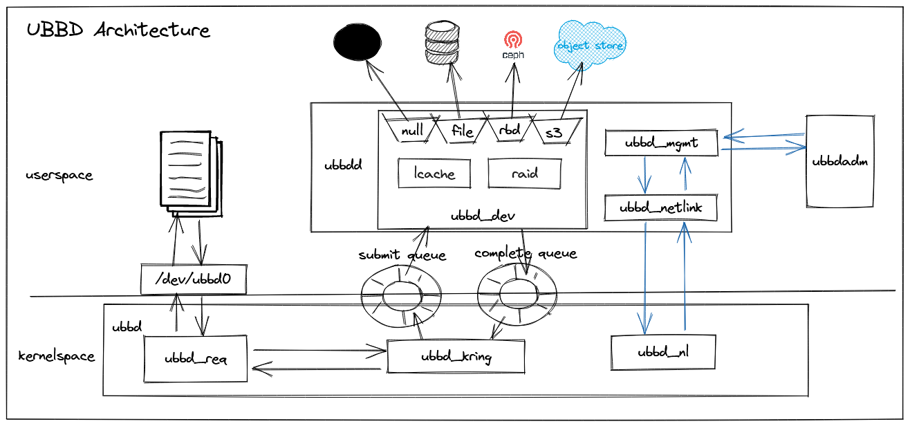

# 1. What is UBBD?

UBBD is **Userspace Backend Block Device**.

# 2. Why we need UBBD?

a) block device driver upgrade online.

b) driver bug dont crash kernel.

c) Dont reinvent the wheel.

Some block storage especially cloud storage has a userspace library
but there is no linux kernel driver to use it. ubbd can make it very easy
to enable linux block device driver for it via library.

d) Decoupling the storage specified logical from a linux kernel block device logical.

# 3. Who:

Who should not use UBBD?  
  Very care about latency(~10us overhead), dont use UBBD driver.

# 4. build and use

    a) install requirements  

    install requirement packages:  

	   [centos]  
	    yum install librbd-devel glibc-devel libnl3-devel  

	   [ubuntu]  
	    apt install -y librbd-dev libc-dev libnl-3-dev libnl-genl-3-dev  

    b) compile  
	   $ make

    c) insert kernel module  
	   $ modprobe uio  
	   $ insmod kmods/ubbd.ko  

    d) start ubbdd daemon  
	   $ ./ubbdd/ubbdd &  

    e) setup a ramdisk and map ubbd device by ubbdadm  
	   $ modprobe brd rd_nr=1 rd_size=2048000 max_part=0  
	   $ ./ubbdadm/ubbdadm --command map --type file --filepath /dev/ram0 --devsize $((1*1024*1024*1024))  

    f) use the /dev/ubbd0 device  
	   $ mkfs.xfs /dev/ubbd0  `

# 5. performance

We can get **15us** latency and **1.8 million** iops with null type ubbd device.

|  backend type|  latency |  iops |
|--------------|----------|-------|
|    null      |    15us  |  1.8M |
|   ramdisk    |    19us  |  1.2M |

# 6. ubbd with rbd

|  solution| iops| latency| rbd journaling| linux block device|
|----------|-----|--------|---------------|-------------------|
|   librbd |10184|  1549us|       support |       No          |
|    krbd  |10724|  1385us|    Not support|       Yes         |
|    ubbd  |10830|  1652us|       support |       Yes         |
|          |     |        |               |                   |

	Note:
		a) ubbd + librbd is mapped by:
			$ ubbdadm/ubbdadm --command map --type rbd --pool rbd --image test --ceph-conf /etc/ceph/ceph.conf
		b) krbd is mapped by:
			$ rbd map test
		c) librbd is tested by fio with ioengine=rbd.
		d) iops is tested by fio with iodepth=128 and numjobs=1.
		e) latency is tested by fio with iodepth=1 and numjobs=1.

**ubbd with rbd-mirror**

We can use ubbd in primary ceph cluster with rbd backend, the all update in primary image
will be synced up to secondary ceph cluster by rbd-mirroring.

# 7. upgrade driver online
As we decoupling the storage related logic with block device, then we can upgrade storage
driver out of kernel module. That means we can upgrade our driver with io inflight on the air.

# 8. Testing:
ubbd-tests is a test-suite runnnig via avocado which is a gread test framework.

[https://github.com/ubbd/ubbd-tests](URL)
