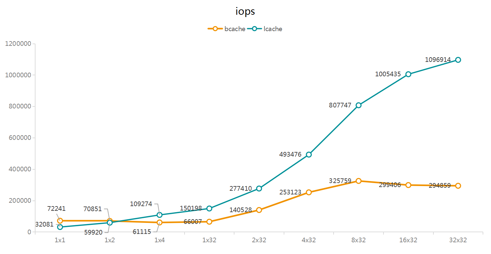

# 1. What is UBBD?

UBBD is **Userspace Backend Block Device**.

# 2. Why we need UBBD?

a) block device driver upgrade online.

b) driver bug dont crash kernel.

c) Dont reinvent the wheel

Some block storage especially cloud storage has a userspace library
but there is no linux kernel driver to use it. ubbd can make it very easy
to enable linux block device driver for it via library.

d) Decoupling the storage specified logical from a linux kernel block device logical.

# 3. Who:

Who should not use UBBD?  
  Very care about latency(~10us overhead), dont use UBBD driver.

# 4. How to use ubbd
**install from source**

    a) install ubbd-kernel  
	   $ git clone https://github.com/DataTravelGuide/ubbd-kernel
	   $ cd ubbd-kernel
	   $ ./build_and_install.sh
	
    b) install ubbd  
	   $ git clone https://github.com/DataTravelGuide/ubbd
	   $ cd ubbd
	   $ ./build_and_install.sh

**install from script**
	
	bash -c "$(wget https://raw.githubusercontent.com/DataTravelGuide/ubbd/master/install-ubbd.sh -O -)"

**install from package**

	$ sudo add-apt-repository ppa:datatravelguide/ppa
	$ sudo apt update
	$ sudo apt install ubbd ubbd-kernel-dkms -y

# 5. performance

5.1）We can get **2 million** iops with null type ubbd device.

	$ fio --name=test --rw=randwrite --bs=4k   --ioengine=libaio --iodepth=32 --numjobs=32 --filename=/dev/ubbd0 --direct=1  --eta-newline=1  --group_reporting --runtime 6
	test: (g=0): rw=randwrite, bs=(R) 4096B-4096B, (W) 4096B-4096B, (T) 4096B-4096B, ioengine=libaio, iodepth=32
	...
	fio-3.19
	Starting 32 processes
	Jobs: 32 (f=32): [w(32)][42.9%][w=8229MiB/s][w=2107k IOPS][eta 00m:04s]
	Jobs: 32 (f=32): [w(32)][57.1%][w=8131MiB/s][w=2082k IOPS][eta 00m:03s]
	Jobs: 32 (f=32): [w(32)][71.4%][w=7236MiB/s][w=1852k IOPS][eta 00m:02s]
	Jobs: 32 (f=32): [w(32)][85.7%][w=7563MiB/s][w=1936k IOPS][eta 00m:01s]
	Jobs: 32 (f=32): [w(32)][100.0%][w=7961MiB/s][w=2038k IOPS][eta 00m:00s]
	test: (groupid=0, jobs=32): err= 0: pid=45505: Fri Sep 22 16:29:59 2023
	write: IOPS=2034k, BW=7946MiB/s (8332MB/s)(46.6GiB/6001msec); 0 zone resets
		slat (nsec): min=1663, max=56336k, avg=12402.61, stdev=86213.25
		clat (nsec): min=1401, max=68157k, avg=488878.62, stdev=997580.04
		lat (usec): min=6, max=68163, avg=501.43, stdev=1004.70
		clat percentiles (usec):
		|  1.00th=[  198],  5.00th=[  262], 10.00th=[  265], 20.00th=[  273],
		| 30.00th=[  281], 40.00th=[  293], 50.00th=[  306], 60.00th=[  326],
		| 70.00th=[  363], 80.00th=[  627], 90.00th=[  791], 95.00th=[ 1172],
		| 99.00th=[ 1991], 99.50th=[ 2507], 99.90th=[12256], 99.95th=[30278],
		| 99.99th=[33817]
	bw (  MiB/s): min= 4346, max=11752, per=99.80%, avg=7930.21, stdev=70.42, samples=352
	iops        : min=1112753, max=3008712, avg=2030131.18, stdev=18027.08, samples=352
	lat (usec)   : 2=0.01%, 4=0.01%, 10=0.01%, 20=0.01%, 50=0.01%
	lat (usec)   : 100=0.02%, 250=3.95%, 500=68.75%, 750=16.07%, 1000=3.64%
	lat (msec)   : 2=6.57%, 4=0.72%, 10=0.14%, 20=0.03%, 50=0.08%
	lat (msec)   : 100=0.01%
	cpu          : usr=11.06%, sys=29.13%, ctx=12085328, majf=0, minf=14979
	IO depths    : 1=0.1%, 2=0.1%, 4=0.1%, 8=0.1%, 16=0.1%, 32=100.0%, >=64=0.0%
		submit    : 0=0.0%, 4=100.0%, 8=0.0%, 16=0.0%, 32=0.0%, 64=0.0%, >=64=0.0%
		complete  : 0=0.0%, 4=100.0%, 8=0.0%, 16=0.0%, 32=0.1%, 64=0.0%, >=64=0.0%
		issued rwts: total=0,12207594,0,0 short=0,0,0,0 dropped=0,0,0,0
		latency   : target=0, window=0, percentile=100.00%, depth=32
	
	Run status group 0 (all jobs):
	WRITE: bw=7946MiB/s (8332MB/s), 7946MiB/s-7946MiB/s (8332MB/s-8332MB/s), io=46.6GiB (50.0GB), run=6001-6001msec
	
	Disk stats (read/write):
	ubbd0: ios=0/12066702, merge=0/0, ticks=0/913888, in_queue=400703, util=98.44%

5.2）we can get more than 1000K iops with lcache backend

lcache VS bcache

# 6. ubbd with rbd

|  solution| iops| latency| rbd journaling| linux block device|
|----------|-----|--------|---------------|-------------------|
|   librbd |10184|  1549us|       support |       No          |
|    krbd  |10724|  1385us|    Not support|       Yes         |
|    ubbd  |10130|  1652us|       support |       Yes         |
|          |     |        |               |                   |

	Note:
		a) ubbd + librbd is mapped by:
			$ ubbdadm map --type rbd --rbd-image test
		b) krbd is mapped by:
			$ rbd map test
		c) librbd is tested by fio with ioengine=rbd.
		d) iops is tested by fio with iodepth=128 and numjobs=1.
		e) latency is tested by fio with iodepth=1 and numjobs=1.

**ubbd with rbd-mirror**

We can use ubbd in primary ceph cluster with rbd backend, the all update in primary image
will be synced up to secondary ceph cluster by rbd-mirroring.

# 7. upgrade driver online
As we decoupling the storage related logic with block device, then we can upgrade storage
driver out of kernel module. That means we can upgrade our driver with io inflight on the air.

When you are going to upgrade ubbd, you can upgrade it as below: 

(1) upgrade ubbdd, it is a daemon to do management for ubbd, there is no IO be handled in this process, 

then you can upgrade it with IO inflight. 

(2) restart backend one-by-one. we can restart each backend one time, that means it is smooth to restart 

all ubbd devices with ubbdadm dev-restart command.

and you can choose the restart-mode in dev-restart command: 

**dev mode:** 
In this mode, ubbdd will stop backend and start a new backend for this device.

**queue mode** 

In this mode, ubbdd will start a new backend firstly, then stop queue in current backend, and start queue in new backend one-by-one
until all queues in this device are working in new backend. At last, stop the old backend and new backend become to current backend.

# 8. Testing:

# 8.1 unittests

unittests in ubbd are supportted in userspace and kernelspace, that means all code in ubbd can be unittested.

**userspace**
userspace unittests is in cmocka test framework. The coverage of cmocka is in unittests/result/index.html

**kernelspace**
kernelspace unittests is in ktf test framework.

# 8.2 function tests

ubbd-tests is a test-suite runnnig via avocado which is a gread test framework.

[https://github.com/DataTravelGuide/ubbd-tests](https://github.com/DataTravelGuide/ubbd-tests)

result like that:

# 9 package build

**rpm build:**

	# ./build_rpm.sh
	
**deb build:**

	# ./build_deb.sh
